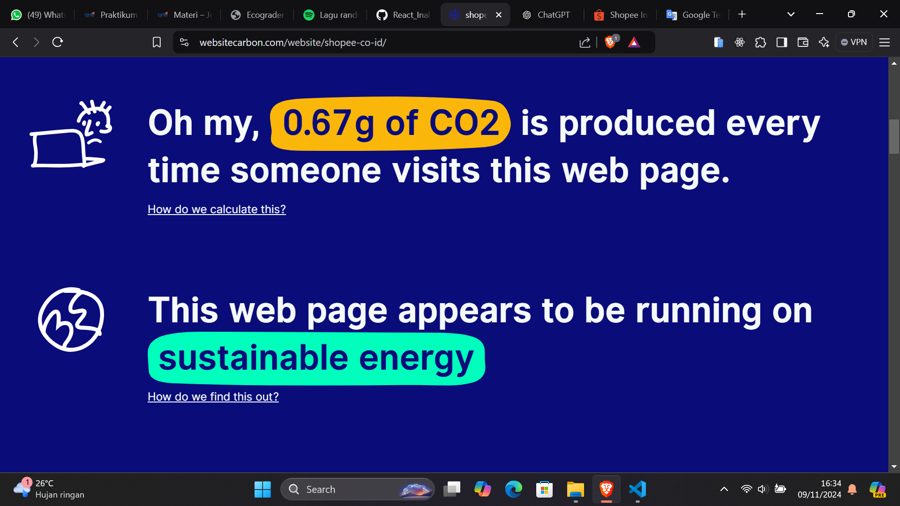

# Tantangan yang dihadapi dalam mengukur jejak karbon pada sebuah website.
salah satu tantangan yang dihadapi dalam megukur jejak karbon pada sebuah website yaitu belum ada standar pengukuran yang seragam serta sulitnya memantau setiap aspek yang memengaruhi emisi secara akurat dan real-time.

# Pengukuran sebuah website shopee
a. website: https://shopee.co.id/
b-c. .png>)
d. 
## gambar diatas mengartikan bahwa setiap seseorang mengakses website shopee maka akan menghasilkan 0.67 g of CO2
.png>)
lebih dari setahun dengan kurang lebih 10.000 pengguna perbulan shopee menghasilkan 78kg co2 ini setara dengan mendidihkan air dengan 10.821 cangkir teh. angka ini setara dengan 208kWh yang artinya seperti mengendarai mobil listrik sejauh 1.334km. Atau setara juga dengan 85 Miliar balon.